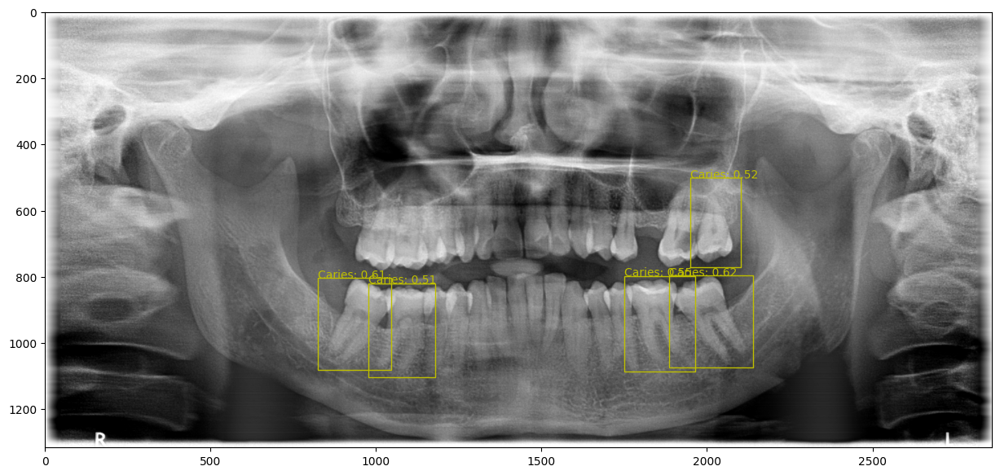
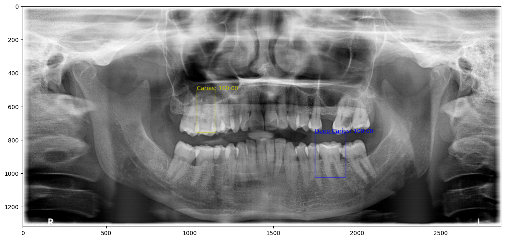
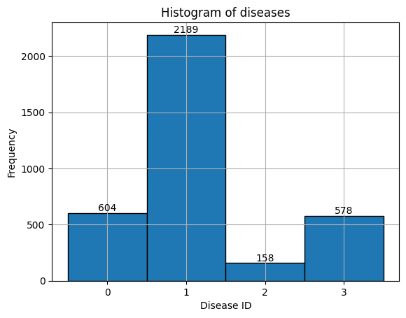

# MALDASC
Repository for Machine Learning and Data Science Project.

## Setup

As we build on previous work of https://github.com/xyzlancehe/DentexSegAndDet the setup is a bit complicated.

1. Create a zip of the folder `previous_work`
2. _Optional:_ If not in HSLU network, download, install & connect to [HSLU VPN](https://www.hslu.ch/de-ch/wirtschaft/campus/bibliothek/infrastruktur/internet/)
3. Open [Jupyter Lab](https://gpuhub.labservices.ch)
4. Upload the `previous_work.zip` in root of the Jupyter Lab workspace
5. Copy & execute `0_Setup.ipynb`

## Projectwork

The objective of this project was to tackle the [Dentex 2023 Grand Challenge](https://dentex.grand-challenge.org/).

The challenge was to recognise the exact position of the tooth (quadrant and location) and to determine its disease (impact, caries, periapical lesion, deep caries). 

### Approaches

I trained a U-NET to obtain simple image segmentation. After that I switched to the task of detecting the teeth and classify respective disease. For this task I chose to train a __Faster-RCNN FPN__ model.

The model consists of several building blocks:
- __Convolutional Neural Network (CNN)__ delivers featuremap
- __RPN Region Proposal Network (RPN)__ proposes potential Region of Interest (RoI) in this featuremap
- __RoI Pooling__ pools the respecive featuremaps
- __Full connected layers (FC)__ process these pooled featuremaps 
- __Classifier__ is the one of the last two FC layers and determines the class of the object
- __Box Regressor__ is the one of the last two FC layers and determines the relevancy score for the object

FPN means that for different levels of convolution, the output is fed into consecutive chain. 

## Training

The training dataset has 510 images, the validations dataset 100 and the testing dataset 67 images.

- Model: [Faster-RCNN FPN v2](https://pytorch.org/vision/main/models/generated/torchvision.models.detection.fasterrcnn_resnet50_fpn_v2.html#torchvision.models.detection.fasterrcnn_resnet50_fpn_v2) with RESNET-50 Backbone. 
- [pretrained weights](https://pytorch.org/vision/main/models/generated/torchvision.models.detection.fasterrcnn_resnet50_fpn_v2.html#torchvision.models.detection.FasterRCNN_ResNet50_FPN_V2_Weights) to enhance the training process
- Performed a grid search to find the best learning rate
- Used a scheduler and early stopping for fast convergence

I trained with learningrates from `5e-6` to `4.5e-7`. The lowest validation loss was with `0.4481`. In the 

## Results

    <figure style="text-align: center;">
        <figcaption>Prediction</figcaption>
        
    </figure>
    <figure style="text-align: center;">
        <figcaption>Ground Truth</figcaption>
        
    </figure>

The model generally made to many prediction and they were usually heavily biased towards `Caries`.

### Test Scores

| Metric                              | Value                          | 
|----                                 |-------                         |
| Mean Average Position (mAP)         | 0.092                          | 
| Mean Average Position per Class     | 0.0000, 0.2829, 0.0097, 0.0741 |
| Mean Average Recall 100 per Class   | 0.0000, 0.9276, 0.2000, 0.8825 | 

Classes
- 0: Impacted
- 1: Caries
- 2: Periapical Lesion
- 3: Deep Caries

The best results in the Dentex Challenge 2023 had mAPs of 0.32. For the classification I found no information.

### Explaination

The result shows that the recalls for `Caries` and `Deep Caries` were very good while the recalls for `Impacted` and `Periapical Lesion` were bad. The model is heavily biased towards the caries categories but seems likely to distinct between them. However the speficity for those classes might also be bad.

The explaination is that the data contains far more `Caries` classifications than the other categories. 

Further Improvements:
- Perform data augmentation (tested but not actually done)
- Try to equalize the classes a bit more
- Try larger models (was not possible due to hardware requirements)

